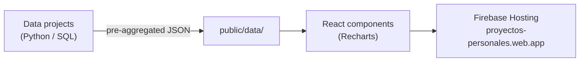
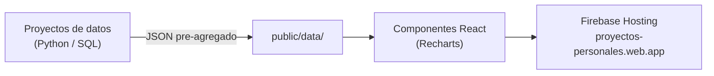

# Data & BI Portfolio — Guillermo Ubeda

> **Personal portfolio web app** · React 19 · Vite · Recharts · Firebase
> **Status:** Live in production
> The single-page app behind [proyectos-personales.web.app](https://proyectos-personales.web.app) — a bilingual showcase that aggregates 15 projects (Data & BI, AI automation, cybersecurity and web) into interactive, in-browser dashboards.

> 🇬🇧 **English version first.** · 🇪🇸 **La versión en español está más abajo** → [ir a Español](#-español).

[](https://proyectos-personales.web.app)
[](.)
[](.)
[](.)
[](LICENSE)

---

## What this is

A recruiter rarely clones a repo — they click a link. This project is that link: a fast, bilingual single-page app that turns a set of standalone data projects into **interactive dashboards anyone can explore in the browser**, with no setup. It is both a portfolio *and* a front-end engineering piece in its own right.

**▶ Live: [proyectos-personales.web.app](https://proyectos-personales.web.app)**

---

## Key features

- **15 projects, one app** — seven rendered as live, interactive dashboards with real charts (Recharts), not screenshots.
- **Emoji-free SVG icon system** — a single `Icon` component with ~30 inline lucide-style icons that inherit each card's accent color and render identically across OS/browsers.
- **Bilingual (EN/ES)** — a custom `LangContext` toggles language across the whole app.
- **SPA routing** — clean per-project routes (React Router).
- **Static-data architecture** — pre-aggregated JSON (built by the ETL pipeline) is served directly; no backend, no cost, instant loads on Firebase Spark.

---

## Project routes

| Route | Dashboard |
|-------|-----------|
| `/` | Home — hero + project grid |
| `/etl` | Sales & Weather ETL |
| `/executive` | Executive Dashboard 360° |
| `/churn` | Predictive Churn Analysis |
| `/hotel` | Hotel Dynamic Pricing |
| `/automations` | n8n Automations |
| `/dashboards` | Power BI / Tableau embeds |

---

## Architecture



Each upstream project (churn, executive, hotel, ETL) exports JSON into `public/data/`; the matching React page reads it and renders the charts. The data pipeline lives in [`project-sales-weather-etl`](https://github.com/Guillermo1987/project-sales-weather-etl).

---

## Tech stack

| Layer | Technology |
|-------|-----------|
| Framework | React 19 · Vite |
| Routing | React Router |
| Charts | Recharts |
| i18n | Custom `LangContext` (EN/ES) |
| Hosting | Firebase Hosting (Spark plan) |

---

## Getting started

```bash
git clone https://github.com/Guillermo1987/project-portfolio.git
cd project-portfolio
npm install
npm run dev        # dev server at localhost:5173
npm run build      # production build → dist/
```

---

## Repository structure

```
project-portfolio/
├── src/
│   ├── App.jsx              # SPA routes
│   ├── contexts/LangContext.jsx   # EN/ES i18n
│   ├── pages/              # one page per project dashboard
│   └── components/         # charts grouped by project
├── public/data/           # static JSON consumed by the dashboards
├── firebase.json          # hosting target + SPA rewrite
├── LICENSE                # MIT
└── README.md
```

---

## License & contact

Released under the **[MIT License](LICENSE)**.

- **Live:** [proyectos-personales.web.app](https://proyectos-personales.web.app)
- **LinkedIn:** [Guillermo Ubeda Garay](https://www.linkedin.com/in/guillermo-ubeda-garay)
- **Email:** guille.ubeda.garay@gmail.com

---

# 🇪🇸 Español

# Data & BI Portfolio — Guillermo Ubeda

> **App web de portafolio personal** · React 19 · Vite · Recharts · Firebase
> **Estado:** En producción
> La single-page app detrás de [proyectos-personales.web.app](https://proyectos-personales.web.app) — un escaparate bilingüe que reúne 15 proyectos (Data & BI, automatización IA, ciberseguridad y web) con dashboards interactivos en el navegador.

> 🇪🇸 Traducción al español. La versión en inglés está al inicio → [ir a English](#data--bi-portfolio--guillermo-ubeda).

---

## Qué es

Un reclutador rara vez clona un repo — hace clic en un enlace. Este proyecto es ese enlace: una single-page app rápida y bilingüe que convierte un conjunto de proyectos de datos independientes en **dashboards interactivos que cualquiera puede explorar en el navegador**, sin instalar nada. Es a la vez un portafolio *y* una pieza de ingeniería front-end por derecho propio.

**▶ En vivo: [proyectos-personales.web.app](https://proyectos-personales.web.app)**

---

## Características clave

- **15 proyectos, una app** — siete renderizados como dashboards interactivos con gráficos reales (Recharts), no capturas.
- **Sistema de iconos SVG sin emojis** — un componente `Icon` único con ~30 iconos inline estilo lucide que heredan el color de acento de cada tarjeta y se ven idénticos en cualquier SO/navegador.
- **Bilingüe (EN/ES)** — un `LangContext` propio cambia el idioma en toda la app.
- **Routing SPA** — rutas limpias por proyecto (React Router).
- **Arquitectura de datos estáticos** — JSON pre-agregado (generado por el pipeline ETL) servido directamente; sin backend, sin coste, cargas instantáneas en Firebase Spark.

---

## Rutas de proyectos

| Ruta | Dashboard |
|------|-----------|
| `/` | Home — hero + grid de proyectos |
| `/etl` | Sales & Weather ETL |
| `/executive` | Executive Dashboard 360° |
| `/churn` | Predictive Churn Analysis |
| `/hotel` | Hotel Dynamic Pricing |
| `/automations` | Automatizaciones n8n |
| `/dashboards` | Embeds Power BI / Tableau |

---

## Arquitectura



Cada proyecto upstream (churn, executive, hotel, ETL) exporta JSON a `public/data/`; la página React correspondiente lo lee y renderiza los gráficos. El pipeline de datos vive en [`project-sales-weather-etl`](https://github.com/Guillermo1987/project-sales-weather-etl).

---

## Stack técnico

| Capa | Tecnología |
|------|-----------|
| Framework | React 19 · Vite |
| Routing | React Router |
| Gráficos | Recharts |
| i18n | `LangContext` propio (EN/ES) |
| Hosting | Firebase Hosting (plan Spark) |

---

## Cómo empezar

```bash
git clone https://github.com/Guillermo1987/project-portfolio.git
cd project-portfolio
npm install
npm run dev        # dev server en localhost:5173
npm run build      # build de producción → dist/
```

---

## Estructura del repositorio

```
project-portfolio/
├── src/
│   ├── App.jsx              # rutas SPA
│   ├── contexts/LangContext.jsx   # i18n EN/ES
│   ├── pages/              # una página por dashboard de proyecto
│   └── components/         # gráficos agrupados por proyecto
├── public/data/           # JSON estático que consumen los dashboards
├── firebase.json          # target de hosting + rewrite SPA
├── LICENSE                # MIT
└── README.md
```

---

## Licencia y contacto

Publicado bajo la **[Licencia MIT](LICENSE)**.

- **En vivo:** [proyectos-personales.web.app](https://proyectos-personales.web.app)
- **LinkedIn:** [Guillermo Ubeda Garay](https://www.linkedin.com/in/guillermo-ubeda-garay)
- **Email:** guille.ubeda.garay@gmail.com

---

*Built by [Guillermo Ubeda](https://github.com/Guillermo1987) · Data & BI Analyst · MBA · ISC2 CC*
